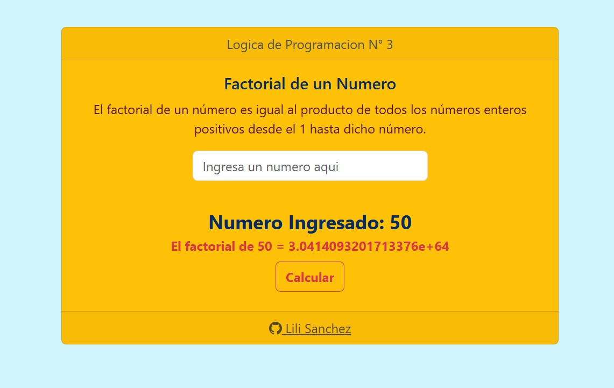

# Calculadora de Factorial en JavaScript

Este proyecto es un programa web sencillo que calcula el **factorial** de un número ingresado por el usuario.  
El factorial de un número `n` es el producto de todos los números enteros positivos desde 1 hasta `n`.

Ejemplo:  4! = 1 × 2 × 3 × 4 = 24

---

## 💻 Tecnologías usadas

- HTML
- CSS (Bootstrap 5)
- JavaScript

---

## 🚀 Cómo usarlo

1. Clona o descarga el repositorio.  
2. Abre el archivo `index.html` en tu navegador.  
3. Ingresa un número en el input.  
4. Haz clic en **Calcular** para ver el factorial.  
5. El resultado aparecerá debajo del input.

---

## 📌 Notas

- El programa valida que el número ingresado sea un entero positivo.  

